background-image: url(https://pbs.twimg.com/media/CasouLgUEAQvHrL.png)

```{css, echo=F}
pre code, pre, code {
  white-space: pre !important;
  overflow-x: scroll !important;
  word-break: keep-all !important;
  word-wrap: initial !important;
}
```

```{r setup, include=FALSE}
options(htmltools.dir.version = FALSE)
```


```{r xaringan-themer, include=F}
library(xaringanthemer)
style_mono_light(base_color = "#23395b",
  header_font_google = google_font("Noto Sans JP"),
  text_font_google   = google_font("Montserrat", "300", "300i"),
  code_font_google   = google_font("Fira Mono")
)
```


---
class: inverse, center, middle

# テンプレート

---
class: left, top

# 英語論文テンプレパッケージ

--

### papaja 

> - APAの出版マニュアルに対応したテンプレート  
- 6版にはもちろん, 最新の7版にも対応


--

### rticles


> - APA以外の学術誌にほぼ対応  
　例) Plos One, Frontier, Elsevier, SAGEなど


---
class: inverse, center, middle

# この感動を君と

---
class: left, top

# パッケージのインストール

注) paper dockerを使用の方はすでにインストール済なので以下の操作は不要です。

### [papaja](https://github.com/crsh/papaja)のインストール


```{r eval=FALSE, tidy=FALSE}
remotes::install_github("crsh/papaja")
```

### [rticles](https://github.com/rstudio/rticles)のインストール

```{r eval=FALSE, tidy=FALSE}
remotes::install_github("rstudio/rticles")
```


---
class: inverse, center, middle

# 焦っちゃだめ...


---
class: inverse, center, middle

# まず環境設定しよ❤️


---
class: left, top


# [rrtools](https://github.com/benmarwick/rrtools)のインストール


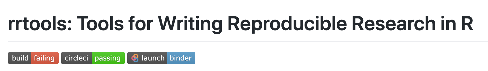

```{r eval=FALSE, tidy=FALSE}
remotes::install_github("benmarwick/rrtools")
```

- Research Compediumをサクッと作ってくれる関数が充実。
- ただResearch Compediumの全体像を理解してないと手に負えないファイルがたくさんセットになってる (難しくはない >>> 最後のセクションで触れます)
- ここでは自力で最小構成のCompediumを作ってみる

```{r eval=FALSE, tidy=FALSE}
dir.create("analysis")
dir.create("analysis/paper")
dir.create("analysis/figures")
dir.create("analysis/data")
```


---
class: inverse, center, middle

# お待たせしました！！！


---
class: left, top

# papajaのテンプレート

- **[File]** >>> **[New]** >>> **[R markdown]** >>> **[From Template]** >>> **[APA article]**

.pull-left[
```{r,echo=F,out.height=200,out.width=200}

```
]

.pull-right[
```{r,echo=F,out.height=400,out.width=1200}
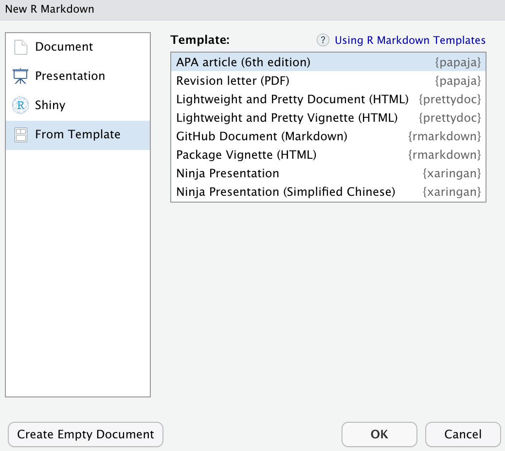
```
]

---
class: left, top

# papajaのテンプレート


- このファイルを編集してknitrすればOK
- とりま任意のファイル名つけてknitrしよ❤️
- 今回はcompediumのpaperフォルダに保存しましょ

.pull-left[
```{r,echo=F,out.height=300,out.width=300}
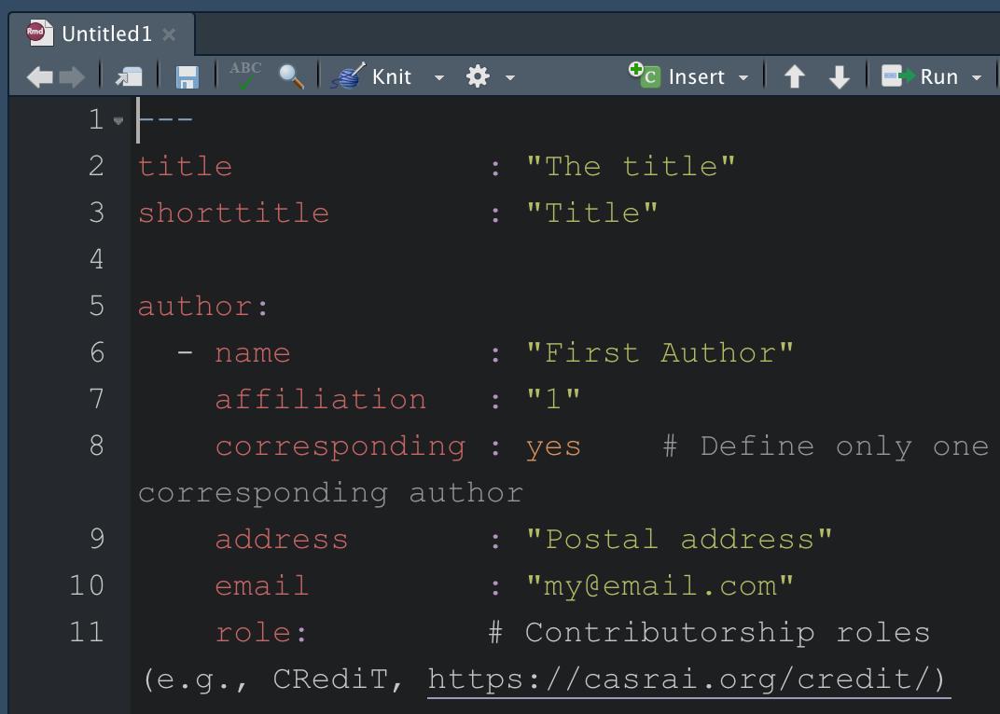
```
]


.pull-right[
```{r,echo=F,out.height=500,out.width=500}
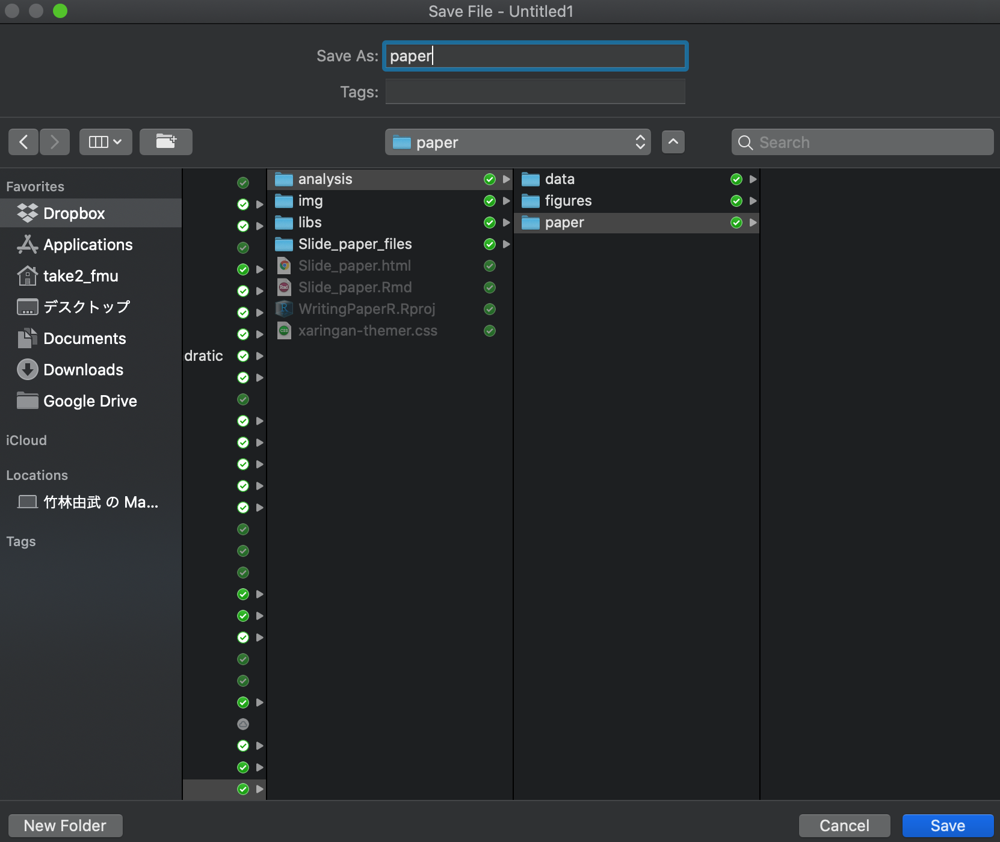
```
]


---
class: left, top

# エディタポップアウトの勧め

### 理由：書きやすい！

.pull-left[
```{r,echo=F}

```
]


.pull-right[
```{r,echo=F}
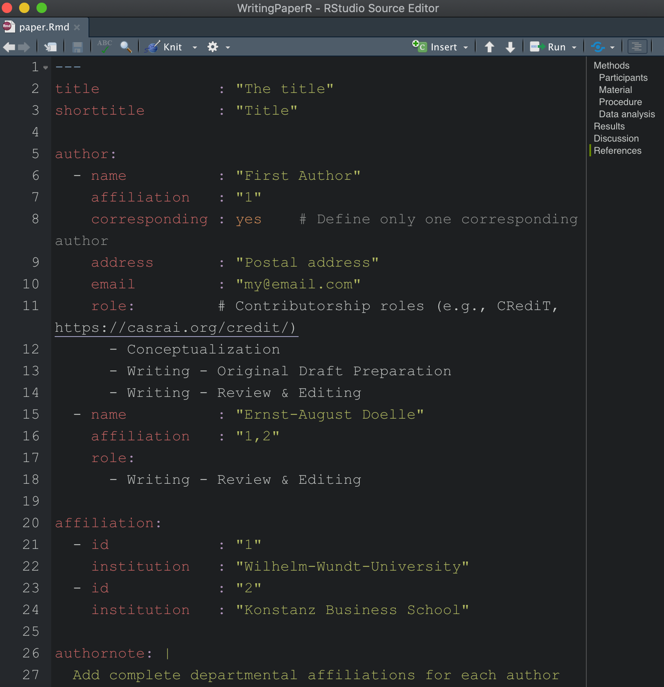
```
]


---
class: left, top

# knitrボタンをクリック！

```{r,echo=F}
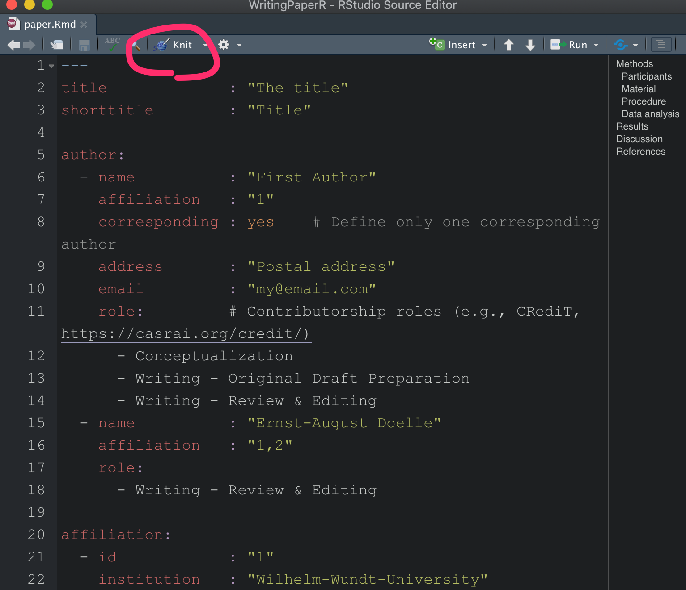
```


---
class: left, top

## なんかそれっぽいのできてる〜❤️

- できたPDFをスクロールしてしばしご堪能ください

```{r,echo=F,out.height=500,out.width=500,fig.align='center'}
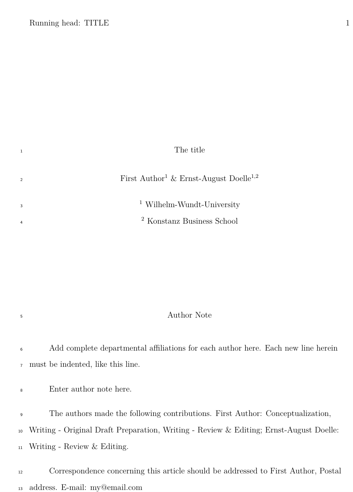
```


---
class: inverse, center, middle

# コンテンツ編集するぞ

---
class: left, top

## YAMLの設定：タイトル, 著者名など

```{yaml, out.height=200, out.width=400}
---
title             : "Reproducible Meta-analysis"

shorttitle        : "Repmeta"

author: 
  - name          : "Yoshitake Takebayashi"
    affiliation   : "1"
    corresponding : yes    # Define only one corresponding author
    address       : "1-Hikarigaoka, Fukushimam, Fukushima, Japan"
    email         : "ytake2@fmu.ac.jp"
    role:  
      - Conceptualization
      - Writing - Original Draft Preparation
      - Writing - Review & Editing
---
```


---
class: left, top

## YAMLの設定

### 所属**[affiliation]**を書き換えてみよう。

```{yaml, out.height=200, out.width=400}
---
  - name          : "Yoshihiko Kunisato"
    affiliation   : "1,2"
    role:
      - Writing - Review & Editing

affiliation:
  - id            : "1"
    institution   : "Fukushima Medical University"
  - id            : "2"
    institution   : "Senshu University"
---
```


---
class: left, top

## YAMLの設定：著者詳細情報

### 著者詳細情報[authornote]を書き換えてみよう。


```{yaml, out.height=200, out.width=400}
---
authornote: |
  Yoshitake Takebayashi is a assistant professor at Department of Health Risk Communication, School of Medichine, Fukuchima Medical University. Yoshihiko Kunisato is a associate professor at Department of Psychology,m School of Human Sciences, Senshu University.
---
```

### 抄録[abstract]を書き換えてみよう。

```{yaml, out.height=200, out.width=400}
---
abstract: |
  Expressive writing is beneficial for promoting both positive psychological and physical health outcomes. Unfortunately, inhibiting emotions is related to impairments in psychological and physical health. James Pennebaker and others have used expressive writing as an experimental manipulation to gauge its efficacy in treating a wide variety of physical and psychological outcomes. While many studies have been conducted that examine the efficacy of expressive writing across such outcomes, a considerable amount of these studies tend to neglect necessary considerations such as different levels of symptomatology, power, and meaningfulness of respective effect sizes. Six previous meta-analyses have been conducted that examine expressive writing's effect on psychological outcomes. However, these studies focus on the experimental versus control group effect size. Thus, our meta-analysis sought to examine the efficacy of an expressive writing task on only the experimental conditions in studies measuring posttraumatic stress, posttraumatic growth, and quality of life using random effects models. Results indicated a small overall effect size for posttraumatic stress and negligible to small effect sizes for posttraumatic growth and quality of life. However, those studies requiring a diagnosis of PTSD exhibited a medium to large effect size. Implications for future research design and interpretation of published research are discussed. 
---
```

---
class: left, top

## YAMLの設定:その他の設定

```{yaml, out.height=200, out.width=400}
---
keywords          : "meta-analysis, depression, anxiety, PTSD"
wordcount         : "X"
bibliography      : ["r-references.bib", "meta_bib.bib"]
---
```

- **[keyword]:** 論文のキーワード
- **[kwordcount]:** knitrすると本文の文字数がカウントされてConsoleに出力されるのでXに転記(ここだけ手動じゃない)

---
class: left, top

## YAMLの設定:その他の設定

```{yaml, out.height=200, out.width=400}
---
bibliography      : ["r-references.bib", "meta_bib.bib"]
---
```

- **[bibliography]:** 引用文献の書誌情報を集めた.bibファイルを指定  
    - r-ferences.bibはpapajaのr_refs関数で、解析に使ったパッケージの引用情報を自動で抽出して作成できる

```{r, echo=T}
library("papaja")
r_refs("r-references.bib")
```


---
class: left, top

## YAMLの設定：その他の設定

```{yaml, out.height=200, out.width=400}
---
#図表を文中にいれるか、最後にまとめるか
floatsintext      : no  

#...listは図表のタイトルを一覧にして最後にまとめるか
figurelist        : no 
tablelist         : no
footnotelist      : no

#文章番号いれるか
linenumbers       : yes

#著者情報ページを隠すか
mask              : yes

#ドラフトマークをいれるか
draft             : no
---
```


---
class: left, top

## YAMLの設定：ドラフトにする

```{yaml, out.height=200, out.width=400}
---
#ドラフトマークをいれるか
draft             : yes
---
```

### knitrしてみると....


---
class: left, top

### なんということでしょう❤️

```{r,echo=F,, out.height=500, out.width=500}
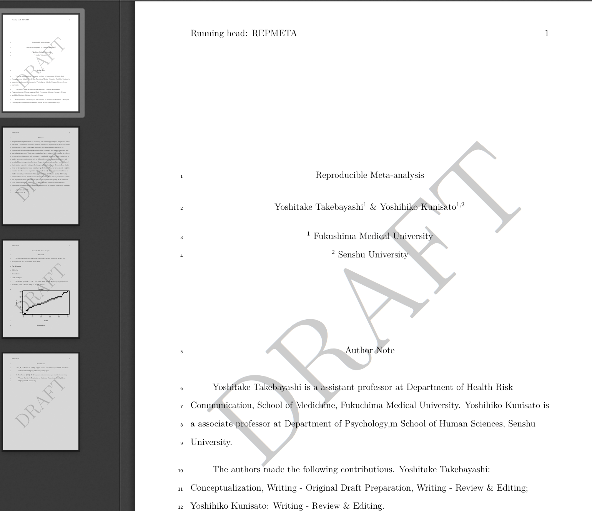
```


---
class: left, top

## Tips: 本文書き込み前に

- 解析やシミュレーションで乱数を使用する場合には、Chunkごとにいちいち設定し直さずにグローバルに設定しておくのも便利

```{r analysis-preferences}
# Seed for random number generation
set.seed(42)
knitr::opts_chunk$set(cache.extra = knitr::rand_seed)
```


---
class: left, top

## 本文の書き込み

- **#** : 大見出し
- **##** : 小見出し
- 基本的には文章をただ書いていくだけ


```{md,}
# Introduction

# Methods

## Participants

## Material

## Procedure

## Data analysis

# Results

# Discussion
```

---
class: left, top

## ここがエモい

### 1. 引用文献の挿入が楽
### 2. 解析結果の図表を転記しなくていい
### 3. Rで解析した数値をそのまま文章に埋め込める

---
class: left, top

## 引用文献の挿入が楽

- citrパッケージを使いましょう。
- paper dockerには搭載済

```{r}
#remotes::install_github("ropensci/RefManageR")
#remotes::install_github("crsh/citr")
library(citr)
```


- .bibファイルに収納されている書誌情報を本文中で指定していくと、knitrすれば自動で引用文献リストを文末につけてくれる。
- 引用文献リストのスタイルは.cslファイルをYAMLで指定する。
- papajaの場合、自動でapaスタイル(apa6.csl)の引用文献リストを作ってくれる。
- ググればほとんどの雑誌の.cslファイルがみつかります。
- .cslファイルがない雑誌には投稿しません。


---
class: left, top

# 引用の挿入

### 1. .bibファイルを作る(作り方はググる)
### 2. .bibファイルをYAMLのbibliographyに指定
### 3. 文中の適当な箇所でcitrのアドイン起動
### 4. ポチる

今回は[こちらから.bibファイルを拝借し](https://osf.io/dje6m/download)paperフォルダに保存しましょう。

---
class: left, top

### 引用の書き方

| Citation type | Syntax | Rendered citation |
|:--------------|:-------|:------------------|
| Citation within parentheses | `[@james_1890]` | (James, 1890) |
| Multiple citations | `[@james_1890; @bem_2011]` | (Bem, 2011; James, 1890) |
| In-text citations | `@james_1890` | James (1890) |
| Year only | `[-@bem_2011]` | (2011) |

####[https://crsh.github.io/papaja_man/writing.html#citation-styles](https://crsh.github.io/papaja_man/writing.html#citation-styles)

---
class: left, top

### citrの使い方

- 本文中の引用文献挿入箇所にカーソルを合わせる
- **[Addins]** >>> **[citr]**

.pull-left[
```{r,echo=F,, out.height=300, out.width=500}
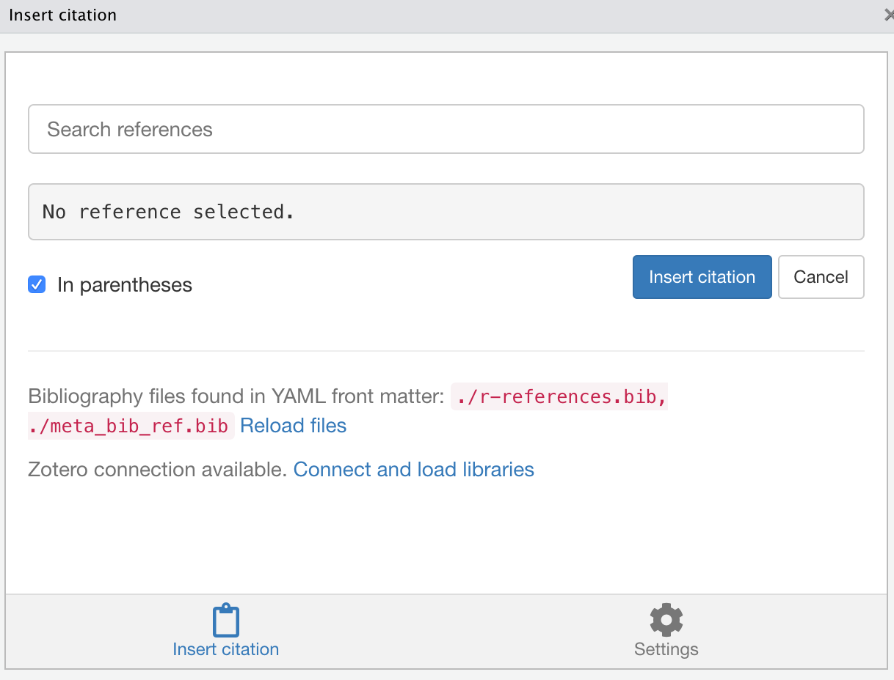
```
]

.pull-right[
```{r,echo=F,out.height=300, out.width=500}
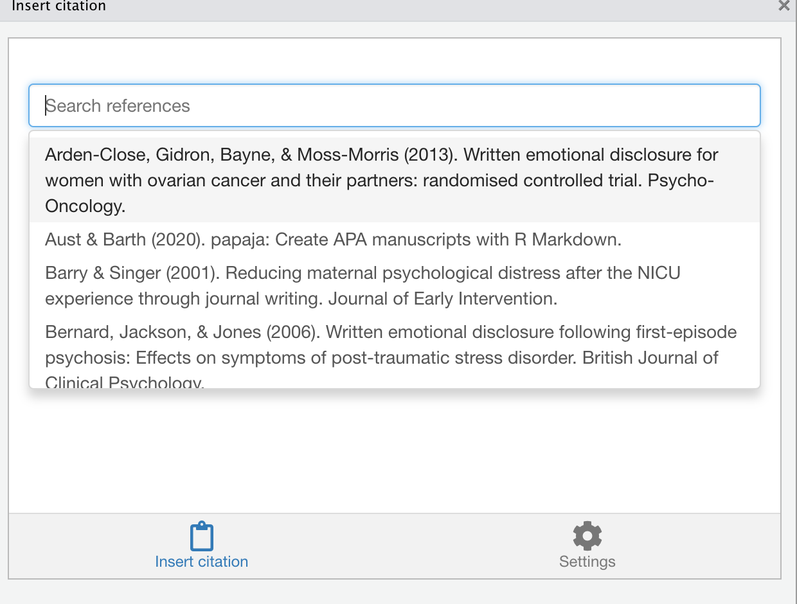
```
]

- bibファイルを自動で読み混んでくれる
- zoteroのデスクトップを開いておくと, zoteroの入れてる論文書誌情報をまるっと使える

---
class: left, top

## 図表作成便利関数: theme_apa

素
```{r,out.width=200, results = 'hide'}
#library(ggplot2)
#qplot(x=cars[,1],y=cars[,2])+
#  xlab("Age")+ylab("Depression")
```
    
theme_apa()
```{r,results = 'hide'}
#library(ggplot2)
#qplot(x=cars[,1],y=cars[,2])+
#  xlab("Age")+ylab("Depression")+
#  theme_apa()
```


---
class: left, top

## 図表作成便利関数: theme_apa

.pull-left[
素
```{r,fig.cap="Correlation between x and y",out.height=400, out.width=400,echo=F}
library(ggplot2)
qplot(x=cars[,1],y=cars[,2])+
  xlab("Age")+ylab("Depression")
```
]
 
  
    
.pull-right[
theme_apa()
```{r, fig.cap="Correlation between x and y",out.height=400, out.width=400,echo=F}
library(ggplot2)
qplot(x=cars[,1],y=cars[,2])+
  xlab("Age")+ylab("Depression")+
  theme_apa()
```
]


---
class: left, top

## 図表作成便利関数: plot三兄弟

### 　apa_beeplot()
### 　apa_lineplot()
### 　apa_barplot()

- beaswarms パッケージが必要です
```{r}
# remotes::install_cran("beeswarm")
```

- 図表のキャプションはChunkの引数で, fig.cap="任意のキャプション名" とすれば、登場する順に図表番号もふってくれる


---
class: left, top

## 図表作成便利関数: apa_beeplot

```{r,out.height=300,out.width=500,fig.align='center'}
apa_beeplot(data = npk, id = "block", 
            dv = "yield", 
            factors = c("N", "P", "K"),
            ylim = c(0, 80), 
            level = .34, las = 1
            )

```


---
class: left, top

## 作図便利関数: apa_lineplot

```{r,out.height=300,out.width=500,fig.align='center'}
apa_lineplot(data = npk, id = "block", 
            dv = "yield", 
            factors = c("N", "P", "K"),
            ylim = c(0, 80), 
            level = .34, las = 1
            )

```

---
class: left, top

## 作図便利関数: apa_barplot

```{r,out.height=300,out.width=500,fig.align='center'}
apa_barplot(data = npk, id = "block", 
            dv = "yield", 
            factors = c("N", "P", "K"),
            ylim = c(0, 80), 
            level = .34, las = 1)

```


---
class: left, top

### 表作成便利関数: apa_table

```{r,results='hide'}
my_table <- t(apply(cars, 2, function(x) # Create data
  round(c(Mean = mean(x), SD = sd(x), Min = min(x), Max = max(x)), 2)
))

apa_table(
  my_table
  , align = c("l", rep("r", 3))
  , caption = "A summary table of the cars dataset."
)

```


### 表作成便利関数: apa_print

```{r,results='hide'}
lm_out <- lm(Sepal.Length~Sepal.Width+Petal.Length+Petal.Width,
             data = iris)

apa_lm <- apa_print(lm_out)
apa_table(
  apa_lm$table
  , caption = "A full regression table."
)

```


---
class: left, top


.pull-left[
apa_table
```{r,echo=F,out.height=300, out.width=500}
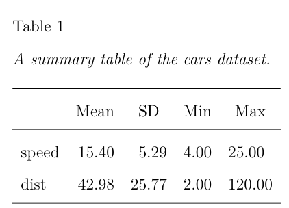
```
]

.pull-right[
apa_print >>> apa_table
```{r,echo=F,out.height=300, out.width=500}
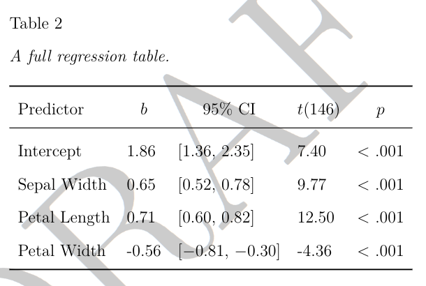
```
]

---
class: left, top

## 文章にも埋め込めまっせ

- t検定

```{r}
out <- apa_print(
  t.test(yield ~ N, data = npk)
)
```

```{r eval = FALSE, highlight = FALSE}
Plant yield indeed differed between groups, `r out$full_result`.
```

> Plant yield indeed differed between groups, `r out$full_result`.

- 回帰分析

```{r}
out <- apa_print(
  lm(yield ~ N, data = npk)
)
```

```{r eval = FALSE, highlight = FALSE}
PPlant yield significantly predicted by groups, `r out$full_result$N1`.
```

> Plant yield significantly predicted by groups, `r out$full_result$N1`.


---
class: left, top

## lm以外にも幅広く対応

```{r supported-s3-methods, echo = FALSE, results = "asis"}
print_classes <- gsub("apa_print\\.", "", as.character(utils::methods("apa_print")))
print_classes <- print_classes[!grepl(",", print_classes)]
print_classes <- c(print_classes, rep(NA,  (4 - length(print_classes) %% 4) * (length(print_classes) %% 4 > 0)))
print_classes <- matrix(print_classes, ncol = 4)
colnames(print_classes) <- apply(print_classes, 2, function(x) {
  first_letters <- tolower(substr(x, 1, 1))
  first_letters <- c(first_letters[1], tail(first_letters, 1))
  first_letters[is.na(first_letters)] <- "z"
  col_names <- if(first_letters[1] == first_letters[2]) first_letters[1] else paste(first_letters, collapse = "-")
  toupper(col_names)
})
print_classes[is.na(print_classes)] <- ""
print_classes[grepl("lsm|emm|glht|ref\\.grid|BayesFactor", print_classes)] <- paste0(print_classes[grepl("lsm|emm|glht|ref\\.grid|BayesFactor", print_classes)], "<sup>*</sup>")
knitr::kable(print_classes, format = "html", escape = FALSE)
```


---
class: left, top

## APA 第7版にも対応できるよ

[https://github.com/crsh/papaja/issues/342](https://github.com/crsh/papaja/issues/342)

```{r,echo=F,out.height=300, out.width=500}
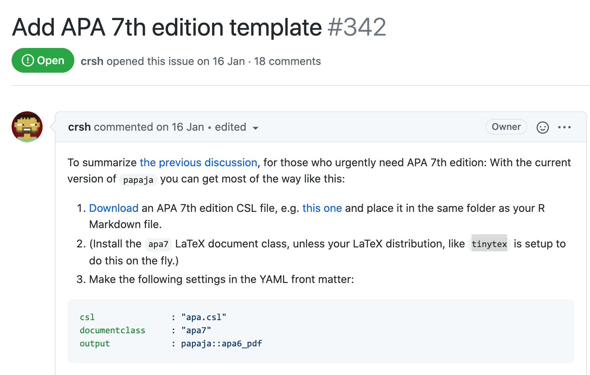
```


---
class: inverse, center, middle

# てかAPA系の雑誌にほとんど出さないんだが...


---
class: inverse, center, middle

# そんなあなたにrticles


---
class: left, top

# rticlesの守備範囲

```{r}
library(rticles)
rticles::journals()
```

- 手順は細かい指定の違いはあれどほぼpapajato
操作は一緒

- APA以外の表作成や作図テーマに関するTipsは[アカデミアのためのRStudio](https://ytake2.github.io/create.manuscript/RStudio_for_Academia.html#rticlesr-rticles)も参考に


---
class: center, middle

# Thanks!

Slides created via the R package [**xaringan**](https://github.com/yihui/xaringan).

